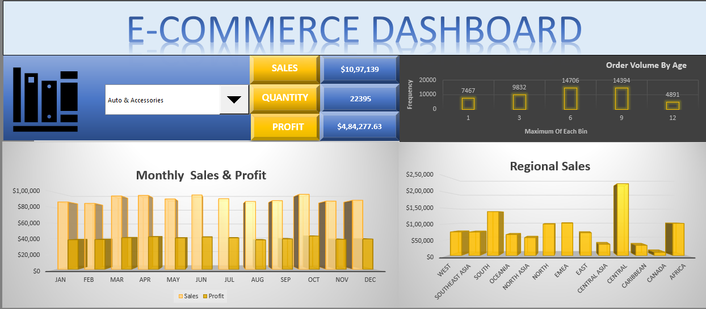

# Excel-Sales-Dashboard
# 🛒 Excel Sales Dashboard — E-Commerce Performance Analysis

### 📊 Overview
This project showcases an **interactive Excel dashboard** designed to analyze and visualize the performance of an e-commerce company across multiple regions, product categories, and months.  
It was created as part of my **Business Analytics with Excel** capstone project, demonstrating full-spectrum Excel skills — from data preparation to visualization.

---

### 🎯 Objectives
- Analyze **sales and profit** trends month-wise and region-wise  
- Study **product category performance** using a **combo box user control**  
- Identify **high-performing and low-performing regions**  
- Deliver a **professional, interactive Excel dashboard** for decision-making

---

### 🧮 Dataset Description
| Column | Description |
|---------|--------------|
| Order ID | Unique identifier for each order |
| Order Date | Date the order was placed |
| Ship Date | Date the order was shipped |
| Ship Mode | Shipping method used |
| Product Category | Category of the product |
| Product Name | Product name |
| Sales | Total sales revenue |
| Quantity | Units sold |
| Discount | Discount applied |
| Profit | Profit earned |
| Shipping Cost | Shipping cost incurred |
| Customer ID | Unique customer ID |
| City, State, Country, Region | Geographical details |
| Months | Month derived from Order Date |

---

### ⚙️ Tools & Skills Used
- **Microsoft Excel**
  - Pivot Tables  
  - Slicers & Combo Boxes  
  - Conditional Formatting  
  - Charts (Column, Line, Pie)  
  - Dashboard Layout & Formatting  
  - Data Analysis Add-in

---

### 🧭 Process Steps
1. **Data Cleaning & Preparation**  
   - Validated data types, removed duplicates, formatted dates  
   - Created month-wise and region-wise tables for sales and profit  

2. **Visualization Creation**  
   - Built column charts for monthly and regional comparisons  
   - Added combo box control for **Product Category** filtering  

3. **Dashboard Design**  
   - Integrated visuals and controls into a single, cohesive layout  
   - Used consistent color palette and typography for clarity  

---


### 📈 Dashboard Preview

<p align="center">
  
  <br><em>Figure 1: Main E-Commerce Sales Dashboard</em>
</p>

<p align="center">
  
  <br><em>Figure 2: Product-Category and Regional Charts View</em>
</p>


---

### 🧠 Key Insights
- Regional sales variation highlights opportunities for targeted marketing  
- Seasonal spikes identified in month-wise sales  
- Profitability varies significantly across product categories  

---

### ✅ Results
An **interactive Excel dashboard** that empowers management to:  
- Explore sales and profit performance dynamically  
- Drill down by region or product category  
- Make data-driven strategic decisions instantly  

---

### 🧩 Ethical Statement
All datasets used in this project are **open-source educational samples** or used solely for **academic and learning purposes**.  
No proprietary or confidential business data is published.

---
### 📂 Repository Structure
### 📂 Repository Structure

```
Excel-Sales-Dashboard/
├── data/
│   └── E-Commerce Dashboard dataset.xlsx
├── assets/
│   ├── dashboard-main.png
│   └── charts-view.png
├── project-01-COMPLETE-DASHBOARD-ASHISH.xlsb
├── 1706207054_01_ecommerce_dashboard_problem_statement.pdf
├── LICENSE
└── README.md
```
